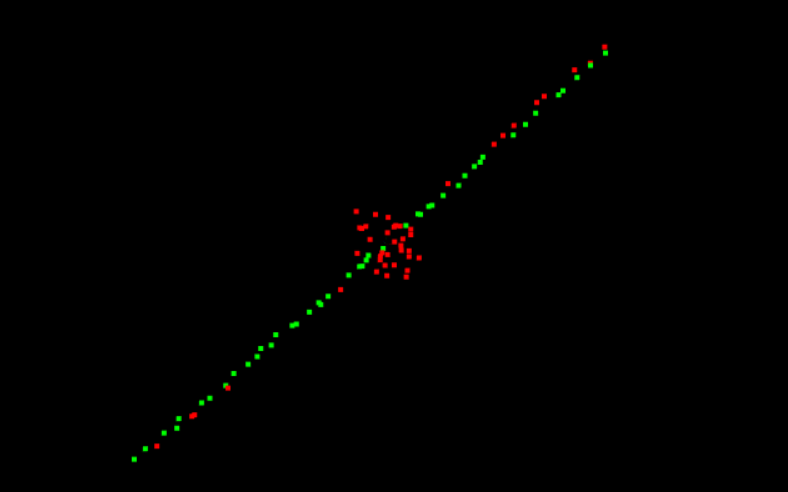
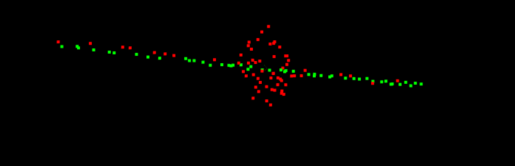

# Point-Cloud-Segmentation

* **RANSAC.cpp** :Contains the RANSAC algorithm code funtion.It takes as parameters :
  - MaxIterations:(int)  The number of time the algorithm will iterate over the point clouds.
  - DistanceTol: (float) The maximum distance required in order to classify the point as inlier.
  - cloud :(pcl::pointCloud >XYZ>) The point cloud data object that holds the data.
  
  These are some of the results i had :
  
  
  

  
