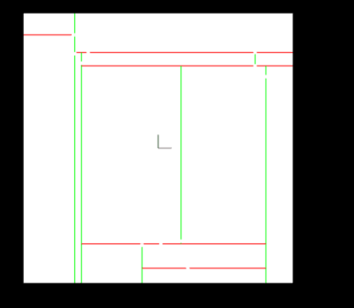

# Point-Cloud-Segmentation

## RANSAC.cpp :
   Contains the RANSAC algorithm code funtion.It takes as parameters :
  - MaxIterations:(int)  The number of time the algorithm will iterate over the point clouds.
  - DistanceTol: (float) The maximum distance required in order to classify the point as inlier.
  - cloud :(pcl::pointCloud >XYZ>) The point cloud data object that holds the data.
  
  These are some of the results i had :
  
   
  
## RANSAC_PLANE.cpp :

  Contains RANSAC algorithm for 3D cloud data points.it takes the same parameters as RANSAC 
  
  Results:
    A|B
    -|-
   |
   
   
   
  ## KdTree.cpp:
  ----------------------------------------------
  
  - This file contains an efficient code implementation of K dimensional Tree data structure:
  - An insert funtion to insert data to the tree.
  - A search function to find the Nodes within a distance threshold.
  
    **Results** :  
    
    
